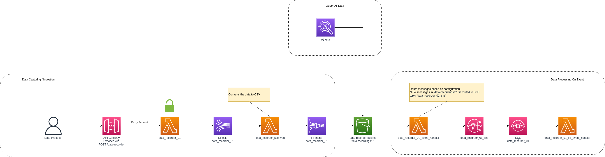

- [Field Notes](#field-notes)
- [Lab 1: Manually Creating Components](#lab-1-manually-creating-components)
  - [Initial Design Goal](#initial-design-goal)
  - [Resource: S3 Bucket](#resource-s3-bucket)
  - [Resource: Lambda function for Kinesis Data Transformation](#resource-lambda-function-for-kinesis-data-transformation)
  - [Resource: Kinesis Data Stream](#resource-kinesis-data-stream)
  - [Resource: Kinesis Firehose Delivery Stream](#resource-kinesis-firehose-delivery-stream)
  - [Resource: HTTP API Gateway and Lambda Function for API Gateway Proxy Requests Handling](#resource-http-api-gateway-and-lambda-function-for-api-gateway-proxy-requests-handling)
  - [Observation on Cost](#observation-on-cost)
- [Lab 2: Infrastructure as Code Lab Resource Provisioning (CloudFormation)](#lab-2-infrastructure-as-code-lab-resource-provisioning-cloudformation)

# Field Notes

I use this file to track observations, ideas etc.


# Lab 1: Manually Creating Components

Here is some notes of how I manually created components.

I used the AWS Web Console with the aim to record all the request in order to record the API calls.

I did this by using the developer tools in firefox to record a HAR file. I can't share the HAR file on GitHub since it includes a lot sensitive information, but the API calls I will document as best I can.

As a side note: I used the [Google HAR Analyzer](https://toolbox.googleapps.com/apps/har_analyzer/) for the actual analysis, and even though it does have a feature to download a redacted version of the HAR file, AWS API calls still contain a lot of sensitive information in the POST data Payload, so it is not safe to share publicly.

## Initial Design Goal

After much reading, I settled on the following initial design:



I will start with the S3 bucket and work my way first to the left. Components to the right is already familiar to me, so I will not spend time on manually creating those. [Lab 2](labs/lab2-construct-cloudformation-template-from-lab1-findings/README.md) will have the CloudFormation template implementation of the design.

## Resource: S3 Bucket

I Created a bucket with public access disabled and encryption enabled (using AWS keys). These were the API calls made:

| Call Order | URL                                                     | Method | Request Data                                                                                                  | Action Description  |
|:----------:|---------------------------------------------------------|:------:|---------------------------------------------------------------------------------------------------------------|---------------------|
| 001        | https://eu-central-1.console.aws.amazon.com/s3/proxy    | `POST` | [001_s3_create_bucket_call.json](labs/lab1-create-solution-using-aws-console/001_s3_create_bucket_call.json)  | Create Bucket       |
| 002        | https://eu-central-1.console.aws.amazon.com/s3/command  | `POST` | [002_s3_create_bucket_call.json](labs/lab1-create-solution-using-aws-console/002_s3_create_bucket_call.json)  | Block Public Access |
| 003        | https://eu-central-1.console.aws.amazon.com/s3/proxy    | `POST` | [003_s3_create_bucket_call.json](labs/lab1-create-solution-using-aws-console/003_s3_create_bucket_call.json)  | Enable Encryption   |

## Resource: Lambda function for Kinesis Data Transformation

Using the [AWS Serverless Application Repository](https://aws.amazon.com/serverless/serverlessrepo/), I created a [Lambda Function](labs/lab1-create-solution-using-aws-console/lambda_functions/data_recorder_kconvert/data_recorder_kconvert_v1.py) to just log the payload and pass it through to the S3 bucket. I will later modify this function to convert the data to CSV suitable for Athena.

The Lambda function create API calls was not captured, as I already know how to define a Lambda function in CloudFormation very well, and I will just use what I already have. I will however attempt to record permissions change API calls when creating Kinesis resources as these will be important for the final CloudFormation template.

## Resource: Kinesis Data Stream

I created a data stream with all the initial settings left at their defaults. The second call was after initial creation that enabled server side encryption (SSE)

| Call Order | URL                                                     | Method | Request Data                                                                                                                    | Action Description  |
|:----------:|---------------------------------------------------------|:------:|---------------------------------------------------------------------------------------------------------------------------------|---------------------|
| 004        | https://kinesis.eu-central-1.amazonaws.com/             | `POST` | [001_kineses_data_stream_call.json](labs/lab1-create-solution-using-aws-console/001_kineses_data_stream_call.json)              | Create Data Stream  |
| 005        | https://kinesis.eu-central-1.amazonaws.com/             | `POST` | [002_kineses_data_stream_enable_sse.json](labs/lab1-create-solution-using-aws-console/002_kineses_data_stream_enable_sse.json)  | Enable SSE          |

## Resource: Kinesis Firehose Delivery Stream

> _**NOTE**_: I got a warning at this stage to increase the Lambda timeout to 1 minute or more. I did that first and then returned to this process.

| Call Order | URL                                                     | Method | Request Data                                                                                                      | Action Description                                                                                                                                       |
|:----------:|---------------------------------------------------------|:------:|-------------------------------------------------------------------------------------------------------------------|----------------------------------------------------------------------------------------------------------------------------------------------------------|
| 006        | https://iamadmin.amazonaws.com/                         | `POST` | [006_kineses_delivery_stream.json](labs/lab1-create-solution-using-aws-console/006_kineses_delivery_stream.json)  | IAM Permissions                                                                                                                                          |
| 007        | https://iamadmin.amazonaws.com/                         | `POST` | [007_kineses_delivery_stream.json](labs/lab1-create-solution-using-aws-console/007_kineses_delivery_stream.json)  | IAM Permissions                                                                                                                                          |
| 008        | https://logs.eu-central-1.amazonaws.com/                | `POST` | [008_kineses_delivery_stream.json](labs/lab1-create-solution-using-aws-console/008_kineses_delivery_stream.json)  | Log Group                                                                                                                                                |
| 009        | https://logs.eu-central-1.amazonaws.com/                | `POST` | [009_kineses_delivery_stream.json](labs/lab1-create-solution-using-aws-console/009_kineses_delivery_stream.json)  | Log Group                                                                                                                                                |
| 010        | https://logs.eu-central-1.amazonaws.com/                | `POST` | [010_kineses_delivery_stream.json](labs/lab1-create-solution-using-aws-console/010_kineses_delivery_stream.json)  | Log Group                                                                                                                                                |
| 011        | https://firehose.eu-central-1.amazonaws.com/            | `POST` | [011_kineses_delivery_stream.json](labs/lab1-create-solution-using-aws-console/011_kineses_delivery_stream.json)  | Delivery Stream - generated a 400 response                                                                                                               |
| 012        | https://firehose.eu-central-1.amazonaws.com/            | `POST` | [012_kineses_delivery_stream.json](labs/lab1-create-solution-using-aws-console/012_kineses_delivery_stream.json)  | Repeat of request 011 - repeated several times... Each time a 400 response was created. I assume the process is waiting for the IAM permission to apply. |
| 013        | https://firehose.eu-central-1.amazonaws.com/            | `POST` | [013_kineses_delivery_stream.json](labs/lab1-create-solution-using-aws-console/013_kineses_delivery_stream.json)  | Delivery Stream - Finally succeeded                                                                                                                      |
| 014        | https://firehose.eu-central-1.amazonaws.com/            | `POST` | [014_kineses_delivery_stream.json](labs/lab1-create-solution-using-aws-console/014_kineses_delivery_stream.json)  | Unsure of what this request is for...                                                                                                                    |
| 015        | https://logs.eu-central-1.amazonaws.com/                | `POST` | [015_kineses_delivery_stream.json](labs/lab1-create-solution-using-aws-console/015_kineses_delivery_stream.json)  | Appears to be getting logs - no events were returned                                                                                                     |

## Resource: HTTP API Gateway and Lambda Function for API Gateway Proxy Requests Handling

Essentially this function just extracts the JSON/FORM data from the API Gateway Proxy request and submits it to the Kinesis Data Stream.

The initial basic setup of the Lambda function was done manually without recording the session, as I already know very well how this part works in IaC.

I also manually created a basic HTTP API Gateway, not yet integrated with the Lambda function. I will record the integration steps.

First, linking the API Gateway to the Lambda Function (Trigger):

| Call Order | URL                                                              | Method | Request Data                                                                                                                    | Action Description                                                                                                                                       |
|:----------:|------------------------------------------------------------------|:------:|---------------------------------------------------------------------------------------------------------------------------------|----------------------------------------------------------------------------------------------------------------------------------------------------------|
| 016        | https://eu-central-1.console.aws.amazon.com/lambda/services/ajax | `POST` | [016_api_gateway_lambda_integration.json](labs/lab1-create-solution-using-aws-console/016_api_gateway_lambda_integration.json)  | Create a trigger                                                                                                                                         |
| 017        | https://eu-central-1.console.aws.amazon.com/lambda/services/ajax | `POST` | [017_api_gateway_lambda_integration.json](labs/lab1-create-solution-using-aws-console/017_api_gateway_lambda_integration.json)  | List Relations                                                                                                                                           |
| 018        | https://eu-central-1.console.aws.amazon.com/lambda/services/ajax | `POST` | [018_api_gateway_lambda_integration.json](labs/lab1-create-solution-using-aws-console/018_api_gateway_lambda_integration.json)  | Get Integration Policy                                                                                                                                   |
| 019        | https://eu-central-1.console.aws.amazon.com/lambda/services/ajax | `POST` | [019_api_gateway_lambda_integration.json](labs/lab1-create-solution-using-aws-console/019_api_gateway_lambda_integration.json)  | List API Gateway Routes (only one exists, so the association is easy to make)                                                                            |

At this point I updated the Lambda function to add logging [as per AWS Documentation](https://docs.aws.amazon.com/lambda/latest/dg/python-logging.html#python-logging-lib) and test teh API Gateway integration with a simple JSON POST.

Once the trigger for the API Gateway to the Lambda function is build, one can test with something like the following:

```shell
curl -vvv -d '{"Message": "Test123"}' -H "Content-Type: application/json" -X POST https://x4nbaf67j9.execute-api.eu-central-1.amazonaws.com/sandbox/data_recorder_01       
Note: Unnecessary use of -X or --request, POST is already inferred.
*   SSL DEBUG MESSAGES OMITTED
> POST /sandbox/data_recorder_01 HTTP/2
> Host: x4nbaf67j9.execute-api.eu-central-1.amazonaws.com
> user-agent: curl/7.68.0
> accept: */*
> content-type: application/json
> content-length: 22
> 
* Connection state changed (MAX_CONCURRENT_STREAMS == 128)!
* We are completely uploaded and fine
< HTTP/2 201 
< date: Sat, 20 Aug 2022 12:08:50 GMT
< content-type: application/json
< content-length: 17
< x-custom-header: my custom header value
< apigw-requestid: XKVA0jtIliAEPtA=
< 
* Connection #0 to host x4nbaf67j9.execute-api.eu-central-1.amazonaws.com left intact
{"message": "ok"}%     
```

The data that the Lambda will receive (in the `event`): [example_api_gateway_proxy_v2_request.json](labs/lab1-create-solution-using-aws-console/lambda_functions/example_api_gateway_proxy_v2_request.json)

Lambda Function Source Code: [data_recorder_kconvert_kinesis_producer.py](labs/lab1-create-solution-using-aws-console/lambda_functions/data_recorder_kconvert_kinesis_producer/data_recorder_kconvert_kinesis_producer.py)

Lambda permissions (policy) in JSON:

```json
{
    "Version": "2012-10-17",
    "Statement": [
        {
            "Sid": "VisualEditor0",
            "Effect": "Allow",
            "Action": [
                "kinesis:PutRecord",
                "kinesis:PutRecords",
                "logs:CreateLogGroup"
            ],
            "Resource": [
                "arn:aws:kinesis:*:000000000000:stream/*",
                "arn:aws:logs:eu-central-1:000000000000:*"
            ]
        },
        {
            "Sid": "VisualEditor1",
            "Effect": "Allow",
            "Action": [
                "logs:CreateLogStream",
                "logs:PutLogEvents"
            ],
            "Resource": "arn:aws:logs:eu-central-1:000000000000:log-group:/aws/lambda/data_recorder_01:*"
        }
    ]
}
```

## Observation on Cost

I ran the first experiment with manually provisioned resources for just over a day. I then looked at my billing dashboard amd saw a cost defined as `Amazon Kinesis OnDemandStreamHr` which recorded `33.585 StreamHr` at `US$ 0.048` per hour for a total of `US$ 34.56` for the Frankfurt region (`eu-central-1`).

# Lab 2: Infrastructure as Code Lab Resource Provisioning (CloudFormation)

The following environment variables is assumed in the command examples:

| Environment Variable Example      | Description                                      |
|-----------------------------------|--------------------------------------------------|
| `export AWS_PROFILE="..."`        | The AWS Credentials Profile to use               |
| `export AWS_REGION="..."`         | The AWS Region to deploy resources to            |
| `export STACK_NAME="..."`         | The name of the CloudFormation stack             |
| `export PARAMETERS_FILE="..."`    | The file containing the stack parameters         |

The parameters to pass into the CloudFOrmation template during deployment must be defined using the following template:

```json
{
    "Parameters": {
      "S3EventBucketParam": "..."
    }
}
```

Assuming you are in the root of this repository, the command to deploy the cloudformation template is as follow:

```shell
aws cloudformation deploy \
    --stack-name $STACK_NAME \
    --template-file labs/lab2-construct-cloudformation-template-from-lab1-findings/template.yaml \
    --parameter-overrides file://$PARAMETERS_FILE \
    --capabilities CAPABILITY_IAM
```

> Progress on 2022-08-24: I tried using KMS, but I seem to miss some kind of permission or policy as I could not get SNS to send messages to SQS, even when both services referenced the same KMS key. See commit 62ce58db5db99e6db91d2b92b4767438d1f258d6 (2022-08-24 05:38) for the config used. I will figure this out at a later stage.
