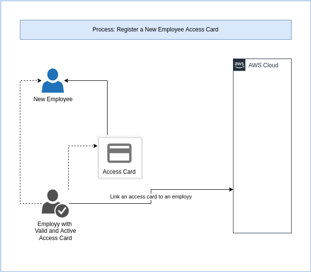
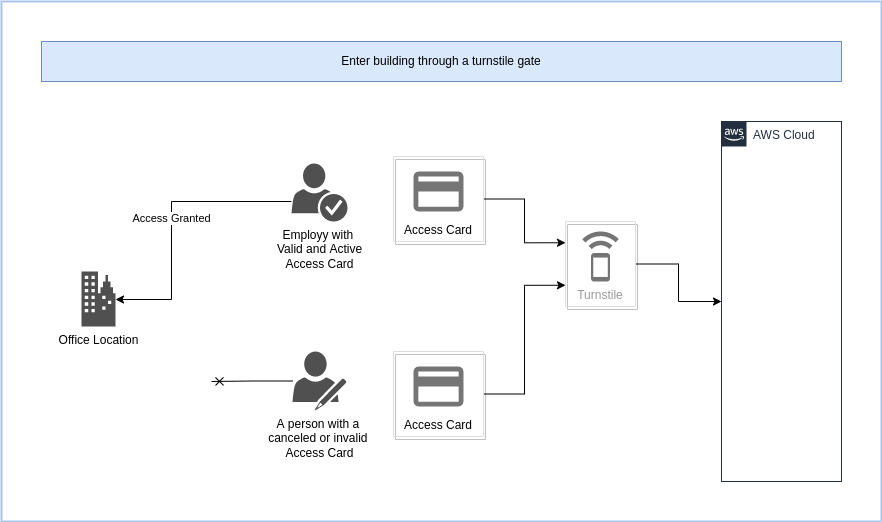
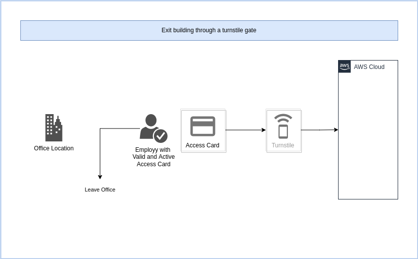
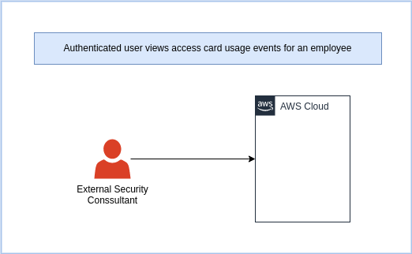

- [Exploring AWS Kinesis](#exploring-aws-kinesis)
- [Resources](#resources)
- [Labs](#labs)
- [Current Progress and Critical Updates](#current-progress-and-critical-updates)
  - [Updates](#updates)
- [Example Application](#example-application)
  - [Process: Register a New Employee Access Card](#process-register-a-new-employee-access-card)
  - [Process: Enter building through a turnstile gate](#process-enter-building-through-a-turnstile-gate)
  - [Process: Exit building through a turnstile gate](#process-exit-building-through-a-turnstile-gate)
  - [Process: Authenticated user views access card usage events for an employee](#process-authenticated-user-views-access-card-usage-events-for-an-employee)
  - [Final Notes](#final-notes)
- [Security](#security)
  - [What are the risks?](#what-are-the-risks)
  - [Controls](#controls)
  - [Use at your own risk](#use-at-your-own-risk)

# Exploring AWS Kinesis

> _**Please Note**_ This is a personal learning experiment and none of the code or examples here are intended for production use. I share my designs, code and other artifacts for the purposes of sharing my experiences and learnings and also to encourage community participation as I believe in the principle of sharing knowledge and experience. 

Please feel free to suggest improvements if you notice I am going down a wrong path

This repository contains experimental artifacts to learn about Event/Message Driven Design using Serverless concepts in AWS.

My personal goal is to explore the serverless options from a business process perspective using a web front-end to capture data that is eventually processed.

I use this repository to explore, learn and test the following AWS Services:

* Kinesis
* Using S3 as a destination
* Using AWS Athena to query S3 data post-ingestion
* React to events in S3 with further SNS and Lambda integration
* SNS and SQS, including the use of dead-letter queues etc.

I also want to explore event-replay to see how such a pattern would work. An example scenario would be a customer support request to re-process data.

Further more I am also interested in the operational aspects and observability options. I want to explore what type of alerts may be required.

# Resources

The following resources serves as sources of knowledge and technical information:

| Title                                                                                                                    | Resource Type | Source                                                                                                                                                  | Publish Date      | Description/Notes                                                                                          |
|--------------------------------------------------------------------------------------------------------------------------|:-------------:|---------------------------------------------------------------------------------------------------------------------------------------------------------|:-----------------:|------------------------------------------------------------------------------------------------------------|
| Event Sourcing on AWS                                                                                                    | Video (16:19) | [Youtube](https://youtu.be/NvuZoDfuoBc)                                                                                                                 | 2021-06-13        | A short and nice introduction to Event Sourcing Patterns using AWS Serverless Resources                    |
| Scalable serverless event-driven architectures with SNS, SQS & Lambda                                                    | Video (32:48) | [Youtube](https://youtu.be/8zysQqxgj0I)                                                                                                                 | 2021-02-05        | A more detailed look at SNS and SQS                                                                        |
| The Many Meanings of Event-Driven Architecture (Martin Fowler)                                                           | Video (50:05) | [Youtube](https://youtu.be/STKCRSUsyP0)                                                                                                                 | 2017-05-11        | A theoretical look from "the man"                                                                          |
| Amazon Kinesis Documentation                                                                                             | HTML/PDF      | [AWS Documentation Portal](https://docs.aws.amazon.com/kinesis/?id=docs_gateway)                                                                        | Regularly Updated | Kinesis documentation and API reference                                                                    |
| AWS Serverless Application Repository                                                                                    | HTML          | [AWS Serverless Application Repository Portal](https://aws.amazon.com/serverless/serverlessrepo/)                                                       | Regularly Updated | Examples and blueprints for common applications that can be re-used                                        |
| Amazon Kinesis Data Firehose Data Transformation                                                                         | HTML          | [Amazon Kinesis Data Firehose Data Transformation Documentation](https://docs.aws.amazon.com/firehose/latest/dev/data-transformation.html)              | Regularly Updated | Notes about data transformation requirements for Lambda functions                                          |
| Cross-Origin Resource Sharing (CORS)                                                                                     | HTML          | [MDN Web Docs](https://developer.mozilla.org/en-US/docs/Web/HTTP/CORS)                                                                                  | Regularly Updated | CORS configuration is required for the API Gateway and this is a great resource                            |
| Configuring CORS for an HTTP API                                                                                         | HTML          | [AWS Documentation for API Gateway v2](https://docs.aws.amazon.com/apigateway/latest/developerguide/http-api-cors.html)                                 | Regularly Updated | Examples of some specific settings relevant to AWS API Gateway                                             |
| Athena compression support                                                                                               | HTML          | [AWS Documentation for Athena](https://docs.aws.amazon.com/athena/latest/ug/compression-formats.html)                                                   | Regularly Updated | Need to consider this when deciding on a file format to store Events in S3 in.                             |
| Best practices for designing and architecting with DynamoDB                                                              | HTML          | [AWS Documentation for DynamoDB](https://docs.aws.amazon.com/amazondynamodb/latest/developerguide/best-practices.html)                                  | Regularly Updated | Required for the real scenario to hold our employee and access card data                                   |
| Use Elastic Load Balancing to distribute traffic across the instances in your Auto Scaling group                         | HTML          | [AWS Documentation for DyEC2 Auto Scaling](https://docs.aws.amazon.com/autoscaling/ec2/userguide/autoscaling-load-balancer.html)                        | Regularly Updated | Interested to see how we can still use traditional EC2 services for basic applications                     |
| How to create a functional VPC using CloudFormation                                                                      | HTML          | [Blog of Kevin Sookocheff](https://sookocheff.com/post/aws/how-to-create-a-vpc-using-cloudformation/)                                                   | 2017-06-07        | Great starting point for creating a VPC in CloudFormation.                                                 |
| Systems Manager prerequisites                                                                                            | HTML          | [AWS Documentation for AWS System Manager](https://docs.aws.amazon.com/systems-manager/latest/userguide/systems-manager-prereqs.html#prereqs-ssm-agent) | Regularly Updated | Helpful points for setting up SSM for Console Connections to EC2 Instances running in Private VPC's        |
| Create VPC endpoints for SSM Console Access to EC2 Instances in Private VPC's                                            | HTML          | [AWS Documentation for AWS System Manager](https://docs.aws.amazon.com/systems-manager/latest/userguide/setup-create-vpc.html)                          | Regularly Updated | Helpful points for setting up SSM for Console Connections to EC2 Instances running in Private VPC's        |
| How do I create VPC endpoints so that I can use Systems Manager to manage private EC2 instances without internet access? | HTML          | [AWS Premium Support Knowledge Center](https://aws.amazon.com/premiumsupport/knowledge-center/ec2-systems-manager-vpc-endpoints/)                       | 2022-02-28        | Helpful points for setting up SSM for Console Connections to EC2 Instances running in Private VPC's        |
| SSM Agent communications with AWS managed S3 buckets                                                                     | HTML          | [AWS Documentation for AWS System Manager](https://docs.aws.amazon.com/systems-manager/latest/userguide/ssm-agent-minimum-s3-permissions.html)          | Regularly Updated | Helpful points for setting up SSM for Console Connections to EC2 Instances running in Private VPC's        |
| AWS Cognito Web App in Pure JavaScript                                                                                   | HTML          | [My Own Blog](https://www.nicc777.com/blog/2022/2022-06-06.html)                                                                                        | 2022-06-06        | I plan to re-use most of the learnings from this post                                                      |
| Authenticate users using an Application Load Balancer                                                                    | HTML          | [AWS Documentation for Elastic Load Balancing](https://docs.aws.amazon.com/elasticloadbalancing/latest/application/listener-authenticate-users.html)    | Regularly Updated | Required for configuration of the ALB Rule for Cognito Integration                                         |
| Using AWS Lambda with an Application Load Balancer                                                                       | HTML          | [AWS Documentation for Lambda](https://docs.aws.amazon.com/lambda/latest/dg/services-alb.html)                                                          | Regularly Updated | Get the Access Token in the request headers and pass it back to the web application                        |
| JQuery API Documentation                                                                                                 | HTML          | [Official JQuery Documentation](https://api.jquery.com/)                                                                                                | Regularly Updated | Using JQuery in the example Web Applications                                                               |
| Bootstrap Documentation                                                                                                  | HTML          | [Official Bootstrap Documentation](https://getbootstrap.com/docs/5.2/getting-started/introduction/)                                                     | Regularly Updated | Using Bootstrap in the example Web Applications                                                            |
| DynamoDB Joins [A How-To Guide] Written by [Lakindu Hewawasam](https://www.linkedin.com/in/lakindu-hewawasam-0820441ab/) | HTML          | [Blog Post](https://dynobase.dev/dynamodb-joins/)                                                                                                       | 2022-04-17        | A good and easy to understand introduction to table design around the familiar RDBMS concept of a JOIN.    |
| Best practices for modeling relational data in DynamoDB                                                                  | HTML          | [AWS Documentation for DynamoDB](https://docs.amazonaws.cn/en_us/amazondynamodb/latest/developerguide/bp-relational-modeling.html)                      | Regularly Updated | An AWS guide going into a more complex example of relational data modeling in DynamoDB                     |
| How to model one-to-many relationships in DynamoDB by [Alex DeBrie](https://twitter.com/alexbdebrie)                     | HTML          | [Blog Post](https://www.alexdebrie.com/posts/dynamodb-one-to-many/)                                                                                     | 2020-03-11        | An even better guide I found for really thinking about table design.                                       |
| Service, account, and table quotas in Amazon DynamoDB                                                                    | HTML          | [AWS Documentation for DynamoDB](https://docs.aws.amazon.com/amazondynamodb/latest/developerguide/ServiceQuotas.html)                                   | Regularly Updated | Keep the service quotas in mind, especially the number of indexes etc.                                     |

_**Note**_: More resources will be added as I find them

# Labs

The various practical exercises I did is located in the `labs` directory. Click on the link for each lab to view the detailed documentation and findings for that lab. Below is a short description of what each lab directory contains:

| Lab Session                                                                       | Description                                                                                                                            | Status      |
|:---------------------------------------------------------------------------------:|----------------------------------------------------------------------------------------------------------------------------------------|:-----------:|
| [Lab 1](labs/lab1-create-solution-using-aws-console/README.md)                    | Creating resources via the AWS Console to get an initial idea of what is required, how it works and the settings required              | Complete    |
| [Lab 2](labs/lab2-construct-cloudformation-template-from-lab1-findings/README.md) | Take learnings from Lab 1 and produce a CloudFormation template (or templates) to easily create more streams ingested from API Gateway | Complete    |
| [Lab 3](labs/lab3-non-kinesis-example/README.md)                                  | A lower volume example without Kinesis - ideal for a mixed environment                                                                 | In Progress |
| Lab 4                                                                             | Operations: replaying old events                                                                                                       | Not Started |
| Lab 5                                                                             | Project Management and DevOps Topic                                                                                                    | Not Started |
| Lab 6                                                                             | Tightening up security. Encryption of data in flight and at rest everywhere.                                                           | Not Started |
| Lab 7                                                                             | A practical application and Load Test                                                                                                  | Not Started |
| Lab 8                                                                             | Add private (internal) SNS Topics for events only originating from internal systems                                                    | Not Started |
| Lab 9                                                                             | Add a custom domain and protect the API Gateway from being called from the AWS URL                                                     | Not Started |
| Lab 10                                                                            | Add authentication and authorization                                                                                                   | Not Started |
| Lab 11                                                                            | Observability                                                                                                                          | Not Started |

# Current Progress and Critical Updates

This project started on 2022-08-18 ~~and I am still in the early stages of collecting theoretical knowledge~~. I got the Kinesis streams working, but there is still a number of things to explore. For example, I want to learn how to protect my data in flight, end-to-end.

More information will be provided on an ongoing bases.

I expect this project to have the following stages:

* ~~Early Exploration~~ 
* ~~Lab Design (based on learnings from documentation)~~
* ~~Lab 1: Manual Lab Resource Provisioning (AWS API and AWS Console)~~
* ~~Lab 2: Infrastructure as Code Lab Resource Provisioning (CloudFormation)~~
* Lab 3: Adapt lab 2 to create a hybrid Kinesis and direct S3 put solution (splitting high volume and low volume data ingestion processes) (`In Progress`)
* Lab 4: Evaluate Athena as a tool to query and replay old captured events
* Lab 5: Reorganize the CloudFormation stacks to a manageable set of files. Invest some time to figure out [AWS::CloudFormation::Stack](https://docs.aws.amazon.com/AWSCloudFormation/latest/UserGuide/aws-properties-stack.html). The aim of this is to see how we can add more events in future in a structured way, with some inheritance and resource project organization.
* Lab 6: Use private KMS in all areas to encrypt data. Introduce data models to enforce input and output validation.
* Lab 7: A practical example with some real logic and a CloudFormation template to setup and run load tests via something like [Locust](https://locust.io/)
* Lab 8: Look at adding SNS Topics or other ingress services for events generated internally (not publicly exposed). Adapt examples - see if some of the external event processing can generate an internal only event. Explore how failures are handled.
* Lab 9: Add a custom domain and look at ways to protect the AWS URL for API Gateway. Also consider ACM and digital certificates.
* Lab 10: Adapt end-points and processing to expose public endpoints (not authorization), and protected end-points (requires API key or authorization token). 
* Lab 11: Play with X-Ray to trace events. Look at how to build dashboards and alerts to monitor when things go wrong. Create specific artificial errors in test for: a) Incorrect input models; b) Valid input model with invalid data (processing failure); c) Authentication/Authorization failures; d) Artificial processing slow down
* Finalize documentation, findings, conclusions and refactor final designs and artifacts
* Maintenance Phase (long term)

## Updates

| Entry Date | Update                                                                                                                                                                                                                                                                                                                                                                                                                                                                                                                                                                                                    |
|:----------:|-----------------------------------------------------------------------------------------------------------------------------------------------------------------------------------------------------------------------------------------------------------------------------------------------------------------------------------------------------------------------------------------------------------------------------------------------------------------------------------------------------------------------------------------------------------------------------------------------------------|
| 2022-11-07 | COncluded lab 3. Wrapping up and adding final notes/thoughts. Starting to look and lab 4.                                                                                                                                                                                                                                                                                                                                                                                                                                                                                                                 |
| 2022-11-05 | Refactored the card linking lambda function. EVen though more lines of code is now used, it looks a lot better.                                                                                                                                                                                                                                                                                                                                                                                                                                                                                           |
| 2022-11-04 | Completed the functional implementation of the card linking lambda function. Refactoring and further testing still required.                                                                                                                                                                                                                                                                                                                                                                                                                                                                              |
| 2022-11-02 | The last couple of days I spent re-thinking the DynamoDB table and finally settled on the changes required. I am now busy finishing up the final linking of the access card to the employee and hopefully tomorrow this will be fully implemented.                                                                                                                                                                                                                                                                                                                                                        |
| 2022-10-28 | The ACM certificate issue was acknowledged by AWS to actually be a problem on their API side (`eu-central-1` and `us-west-2` regions). Tried to create the ACM certificate, but automatic DNS validation still not working. Will try again during the weekend to complete the changes of the last 2 days.                                                                                                                                                                                                                                                                                                 |
| 2022-10-27 | Tried to deploy all the stacks today, but I got stuck with the ACM certificate failure, resulting i various stacks failing. Followed the troubleshooting guidance in the [AWS Support Pages](https://aws.amazon.com/premiumsupport/knowledge-center/cloudformation-internal-failure-error/), but the CloudTrail logs does not show any hints as to the reasons for the failure. Will retry again tomorrow.                                                                                                                                                                                                |
| 2022-10-26 | Starting to realize that the initial scenarios I thought about was way to ambitious. I originally had 4 scenarios, but I'm thinking of sticking to two only: 1) Linking cards and 2) scanning card. The first will be to implement a S3 event flow and the second a Kinesis flow.                                                                                                                                                                                                                                                                                                                         |
| 2022-10-25 | Realized today I need to modify the DynamoDB table. One lesson I learned now is that DynamoDB table modifications can be hard/complex.                                                                                                                                                                                                                                                                                                                                                                                                                                                                    |
| 2022-10-24 | Over the weekend started working on the final leg of the persistence of the link card event. I must say, this feature is taking really a lot longer to implement that I originally thought.                                                                                                                                                                                                                                                                                                                                                                                                               |
| 2022-10-21 | Added the SQS Queue to get the event in order to pass it on to the Lambda function that will finally validate and persist the event.                                                                                                                                                                                                                                                                                                                                                                                                                                                                      |
| 2022-10-20 | Finished off publishing SNS event for linking a access card to an employee. Ready now to start the final leg for processing the event and committing it to DynamoDB.                                                                                                                                                                                                                                                                                                                                                                                                                                      |
| 2022-10-19 | Implemented logic to determine the exact S3 event type and details. Added configuration file for Lambda function to configure event matching criteria and routing data. Still need to implement the actual routing logic.                                                                                                                                                                                                                                                                                                                                                                                 |
| 2022-10-18 | Looking at the events generated from S3 and received via SQS, I can see that the formatting of the event details can be problematic for the Python JSON parser (JSON embedded in JSON). I wave found a work around and will now proceed to implement the logic to extract the S3 event and from the keyu the event type can be determined and routed to the appropriate down-stream SNS topic for final event processing.                                                                                                                                                                                 |
| 2022-10-16 | Completed the UI of the card linking web page and tested with various positive and negative test cases. I will next focus on the consuming of the S3 events.                                                                                                                                                                                                                                                                                                                                                                                                                                              |
| 2022-10-14 | Yesterday and today I worked on the web page to link an employee to an access card. I spend a fair amount of time just on the retrieval of the current employee info, and the page is therefore now almost 50% done - still need to implement the actual linking of a card.                                                                                                                                                                                                                                                                                                                               |
| 2022-10-12 | I added another attribute in Cognito to set the employee ID. I also added a new attribute in DynamoDB to store the Cognito SUbject ID. Therefore, each employee is now linked between Cognito and DynamoDB. In Cognito I set the `employee-id` field as immutable as an employee ID will forever be linked only to one person, regardless if that person leaves the company and rejoins again later. This is common practice in several large enterprises.                                                                                                                                                |
| 2022-10-11 | Implemented the event capturing for linking an access card to an employee. One additional change I need to make is to store the Cognito subject ID also in the DynamoDB table for employees in order to match the linking employee ID to the authorized token. I also need to figure out the scopes and enforce that part of the authorization so tat only certain employees can perform this action.                                                                                                                                                                                                     |
| 2022-10-07 | Added the S3 bucket for holding event objects.                                                                                                                                                                                                                                                                                                                                                                                                                                                                                                                                                            |
| 2022-10-06 | Tested the new API to get access card status. I also refactored the CloudFOrmation templates and broke down the original API Gateway stack into smaller parts. The main reason for this was that the Lambda function integration and routes can be a single stack that is called multiple times for each required Lambda integration.                                                                                                                                                                                                                                                                     |
| 2022-10-05 | Spent today more researching and preparing for the next couple of changes. Added some issues on GitHub just to help me focus.                                                                                                                                                                                                                                                                                                                                                                                                                                                                             |
| 2022-10-04 | Today I refined the UI for displaying all issued cards and I learned a lot about the finer details of formatting data using [DataTables](https://datatables.net/). I opted for using JavaScript functions (essentially a class) to store each record, and then by configuring [Column Renderers](https://datatables.net/reference/option/columns.render) for custom rendering of each field, for example converting the Unix Timestamp to a human readable date etc.                                                                                                                                      |
| 2022-10-03 | Even though I have not written updated in the last couple of days, I have in fact been very busy. I realized my initial DynamoDB design was all wrong, so the bulk of the effort went into the redesign of the data and after that the updating of the code that has to deal with that data. Some more cleanup is probably required, amd I am sure the data can be improved even more. AFter all of that effort I was able to implement the UI elements to retrieve the data and display it in a table on a web page. This was a very big effort, but I learned a lot!                                    |
| 2022-09-27 | I was able to deploy, test and verify the Lambda function for obtaining the access token works. I adapted the initial example web based application to consume the access token after initial loading. I am now ready to work on the actual web application.                                                                                                                                                                                                                                                                                                                                              |
| 2022-09-26 | Today I did not make a lot of progress due to other commitments. I am busy working on an additional Lambda function behind the ELB that will be able to send the Access Token (JWT) to the web application front-end.                                                                                                                                                                                                                                                                                                                                                                                     |
| 2022-09-25 | I learned that my logout URL on the website wasn't working because I have not exposed the domain details to the deployment scripts which means the regex cannot replace the placeholder string in the appropriate JS file. A fairly extensive update followed, and I realize there must be better ways to expose changing variables to the GitHub Sync Server stack - but I need to dig deeper into this topic at some other time. I added a custom domain to the API gateway and now I can start work on a Cognito integrated authorization configuration. Added Cognito integrated API Authorization.   |
| 2022-09-24 | I managed to fairly easily expose the API with the lambda function.                                                                                                                                                                                                                                                                                                                                                                                                                                                                                                                                       |
| 2022-09-23 | Refining the Lambda function to retrieve the list of employees. I still need to add parsing of query string parameters. After that, the function is ready for initial integration into an API Gateway end point.                                                                                                                                                                                                                                                                                                                                                                                          |
| 2022-09-22 | Completed the Cognito integration into Elastic Load Balancer by configuring listener rules. Turns to be working great and it was easier to implement than I expected.                                                                                                                                                                                                                                                                                                                                                                                                                                     |
| 2022-09-21 | Tested the deployed website for logging into the Cognito userpool and it is all technically working. ~~I still need to do some more work on the deployment to complete the processing of the userpool and client ID's to update the variables for the website JavaScript files.~~                                                                                                                                                                                                                                                                                                                         |
| 2022-09-20 | Created the Cognito userpool and tested with a localhost hosted web client as per [this example project](https://github.com/nicc777/aws-cognito-pure-js-example) from [this blog post](https://www.nicc777.com/blog/2022/2022-06-06.html) I did earlier in the year. The Static pages in [the related web project](https://github.com/nicc777/exploring-aws-kinesis-static-website) has been updated, but the deployment and source files still has to be adapted for full functionality. For this, some additional environment variables must be made available in the GitHub sync server stack.         |
| 2022-09-19 | The last couple of days I have tried to get the deployment of the web server components done. This turned out to be some challenge, mainly due to file system permissions with FSX, which took me a while to pin point as the cause. At least that is now working and I have also implemented Load Balancer Listener rules to ensure each domain is hard linked to a specific secure port - WWW traffic uses port 443 and "internal" traffic must use port 8443. I will now start on the Cognito user pool for Internal site authentication and authorization on the Load Balancer.                       |
| 2022-09-16 | Started working on the web serving solution. Having a bit of a challenge finding an optimal solution to host the EC2 web server instances in a private VPC while bringing in the web traffic via the Public VPC. Omitting the current configs in the public VPC at least gets the stack deployed. Also still need to add proxy configuration for Docker.                                                                                                                                                                                                                                                  |
| 2022-09-15 | Finally a milestone where the GitHub sync server now works end-to-end. When a new release is posted in the [exploring-aws-kinesis-static-website](https://github.com/nicc777/exploring-aws-kinesis-static-website) repository, the integrated webhook make a call to a Lambda function which starts the EC2 instance which deploys the changes. I can now start to work on the actual web server portion of the solution. Even though I can use S3 and CloudFront for static hosting, I decided to experiment a little with EC2.                                                                          |
| 2022-09-14 | I reduced the number of subnets in the VPC End Point deployments to 1 subnet per end point in order to reduce cost. Still working on the GitHub sync server. THe end is in sight - just need to finish a bit more code to handle the final deployment script once the release archive file is on the sync server.                                                                                                                                                                                                                                                                                         |
| 2022-09-13 | The last couple of days I worked on getting the Lambda functions for the GitHub sync server ready, but again that took a little longer than I anticipated. Starting today, I am still testing and sorting out a couple of issues, but the Lambda functions are more-or-less done now and then I can wrap up by implementing the logic for the actual EC2 instance to run deployments.                                                                                                                                                                                                                     |
| 2022-09-10 | Solved the problem I had connecting to EC2 instances in Private VPC by adding required VPC End Points for SSM and KMS.                                                                                                                                                                                                                                                                                                                                                                                                                                                                                    |
| 2022-09-09 | Progress this morning was frustratingly slow as I am strugling to get the configuration for the Load Balancer right. Also, the EC2 instances deployed in the private VPC is still not able to work with SSM console connections, so I have to troubleshoot that as well.                                                                                                                                                                                                                                                                                                                                  |
| 2022-09-08 | Still busy with creating the EC2 instance to manage the GitHib deployments. SSM Connect does not work yet. Also busy fixing the proxy connection (final tests to be done) to ensure the EC2 instance can reach the Internet.                                                                                                                                                                                                                                                                                                                                                                              |
| 2022-09-07 | Started working on the stacks that will allow any changes on Static Web Page Artifacts to by synchronized to the FSX volume. Still much work to do on this pattern.                                                                                                                                                                                                                                                                                                                                                                                                                                       |
| 2022-09-06 | I eventually realized that the certificate I was trying to create for the Proxy server fails because it is a private hosted zone and I probably need a private ACM, which requires a Private CA - something that costs US$400 a month. So the internal proxy server will run unsecured on port 8080. I have successfully added a Load Balancer and DNS record for the Load Balancer to the Proxy server.                                                                                                                                                                                                  |
| 2022-09-05 | In [Lab 3](labs/lab3-non-kinesis-example/README.md) I added SSM access to EC2 Instances via the AWS Console. As a result, SSH access was also now removed. The only way to access an instance terminal now is via AWS Console. Started adding ELB to the proxy server setup, but at the moment ACM fails to create - still need to trouble shoot this.                                                                                                                                                                                                                                                    |
| 2022-09-04 | Sometimes I don't always know just how much a chew off... Today I realized that the _simple_ example application I created requires a ton of additional resources I did not initially thought about. This is not a bad thing, but the effect is that [Lab 3](labs/lab3-non-kinesis-example/README.md) will take considerably longer to complete than what I initially thought. In any case, it is still a worthwhile exercise and I am learning (or re-learning) a ton of stuff. More update to follow in the coming weeks.                                                                               |

# Example Application

Lab 1 and 2 are early exploratory labs and as such, they will not contain any meaningful data or even processing functions - it's basically boilerplate stuff to see if it works.

From Lab 3 I am starting to think about a practical application. I have settled on a _"Employee Access Card Usage Event Capturing System"_.

First of all, there are two types of event sources to consider:

* Events from external sources: these are events from devices that have scanned a RFID badge and now submits that data to a public API and-point. We could argue that the AWS IoT services may be better suited for this, but for now I am going to pretend that those services do not exist. At some point I would also introduce some kind to authorization (API Key) so that we ensure that our data is only collected from trusted devices. We will simulate a number of offices where many thousands of people can access turnstiles, vending machines and many other devices that access cards can be scanned for use. There are scenarios, like a person entering a building via a turnstile gate, where a card swipe needs to be synchronize and these scenarios are not ideal for Kinesis. There are other scenarios that may be high volume and where Kinesis can be used, for example to exit a building (always allow - but delay processing).
* Other events are from trusted sources inside our infrastructure that do not require access via a public API Gateway. An example would be when HR from a secured workstation issue a new access card to an employee.

In this scenario and broad use-cases, I would therefore build up the following applications with their relevant events:

## Process: Register a New Employee Access Card

A new Access Card is Issued.

| Requires API Gateway | Sync/Async   | High Volume | Authentication | Authorization |
|:--------------------:|:------------:|:-----------:|:--------------:|:-------------:|
|  No                  |  Async (Web) |   No        | AWS Cognito    | JWT Token     |

## Process: Enter building through a turnstile gate

A person enters the building and must scan their access card at the turnstile gate.

| Requires API Gateway | Sync/Async   | High Volume | Authentication | Authorization |
|:--------------------:|:------------:|:-----------:|:--------------:|:-------------:|
|  Yes                 |  Sync        |   No        | n/a            | API Key       |

## Process: Exit building through a turnstile gate

A person exits the building. In emergencies, this could be a high volume scenario.

| Requires API Gateway | Sync/Async   | High Volume | Authentication | Authorization |
|:--------------------:|:------------:|:-----------:|:--------------:|:-------------:|
|  Yes                 |  Async       |   Yes       | n/a            | API Key       |

## Process: Authenticated user views access card usage events for an employee

An external auditor review key scan logs of an individual.

| Requires API Gateway | Sync/Async   | High Volume | Authentication | Authorization |
|:--------------------:|:------------:|:-----------:|:--------------:|:-------------:|
|  Yes                 |  Async (Web) |   No        | AWS Cognito    | JWT Token     |

## Final Notes

_**Note**_: Async events can use Kinesis if it is a potential high volume scenario. Events are buffered and therefore there can be small delays before events are processed.

Another business rule we will introduce is that access cannot be allowed if the current employee is considered to be already in the building. In other words, you must scan out before you can scan back in. This means that sometimes when an employee goes out, and immediately tries to go back in, they may have to wait a little.

The actual card state will be maintained in a DynamoDB table.

# Security

Here are some guidelines to security while playing with these lab experiments.

## What are the risks?

There are some general AWS related risks that is beyond the scope of this document. A good example would be not to store any sensitive information like your AWS access key and secret key in a public repository. I will not dwell on these here, but rather focus only on the risks and controls related specifically to the lab experiments.

Therefore, I identified the following risks:

* Exposed public Internet endpoint misuse, (D)DoS or hacking attempts
* Malware, especially in third party libraries in Lambda functions or in JavaScript libraries in the static web site components
* Malware in EC2 instance packages

## Controls

Keep in mind these are labs with all resources defined in CloudFormation templates, and as such the first very basic but important control is to delete the CloudFormation stacks as soon as the experiment is done or when there will be a period when no development or testing will take place (i.e. overnight). If the resources are not deployed, they cannot be exploited.

From the CloudFormation template perspective, I will endeavour to limit the IAM roles (where applicable), to align to the [least privileged principle](https://www.techtarget.com/searchsecurity/definition/principle-of-least-privilege-POLP). Components that require elevated or administrator access will not be exposed directly to the Internet. A good example is the GitHub sync server, which requires to deploy resources and as such requires administrator privileges. In the case of the GitHub sync server, the EC2 instance will only be deployed in the Private only VPC and it will not directly be possible to connect to it. Instructions to this instance will be via SQS after ingestion of a GitHub webhook call that will first be parsed to ensure only whitelisted repositories are processed.

During lab #3 I starting thinking about exposed end-points and how to limit access. In this context, I will implement the following controls (some may be work in progress at the time of writing):

* Require an API key or special HTTP header and value before incoming requests are processed
* White listing of trusted IP addresses as far as possible to allow only trusted sources from the Internet
* Validation of parameters when processing API calls that include payloads

In terms of vulnerability management, I choose to rely on the following controls:

* Enable [Snyk](https://snyk.io/) scanning of my GitHub repositories
* Rely on third party libraries from official sources (PyPi, for example). Snyk will also assist here in terms of identifying vulnerable components and information about mitigation

## Use at your own risk

I share these experiment on a public platform with the intention of sharing knowledge and also to accept potential advice. However, these labs are experiments and therefore any person wishing to take some of these into their own environments should first thoroughly review the code. I cannot take responsibility for how the examples presented here is used or adapted. I welcome feedback in order to improve security at any time.

Please keep in mind that this is a repository for learning and experimentation and there should be _**No**_ expectation that any of the components demonstrated here are fully secured or used in a secure way.

The controls listed above is also in constant review and subject to continuos improvement. If you do spot glaring problems, please bring them to my attention by opening an issue.

.