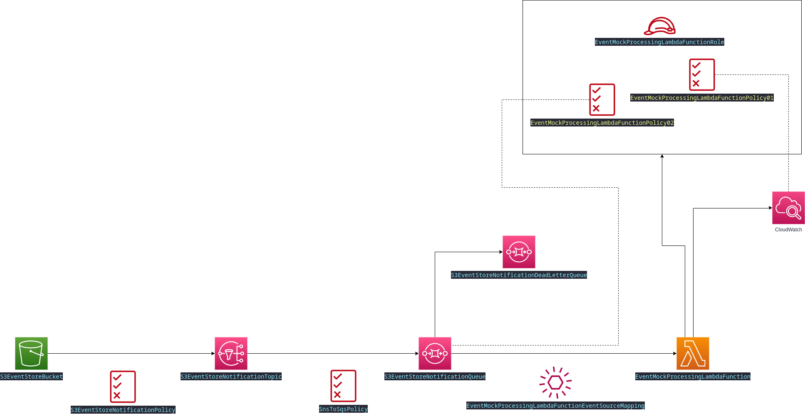
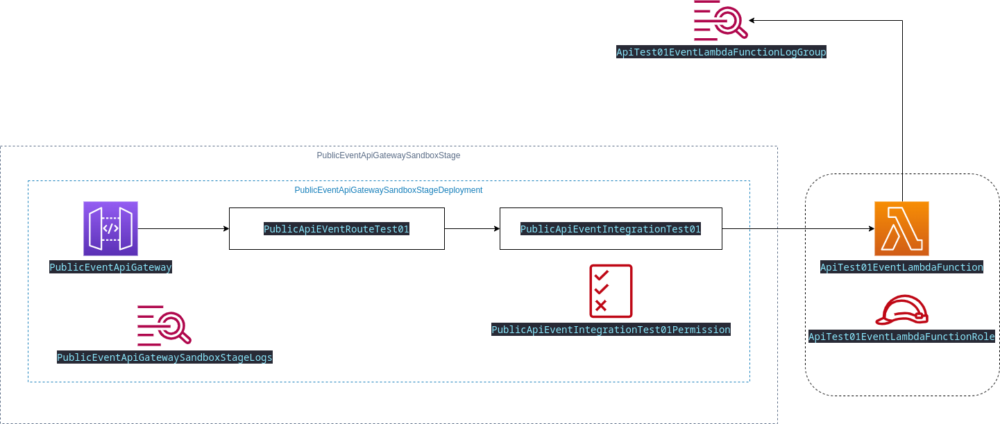
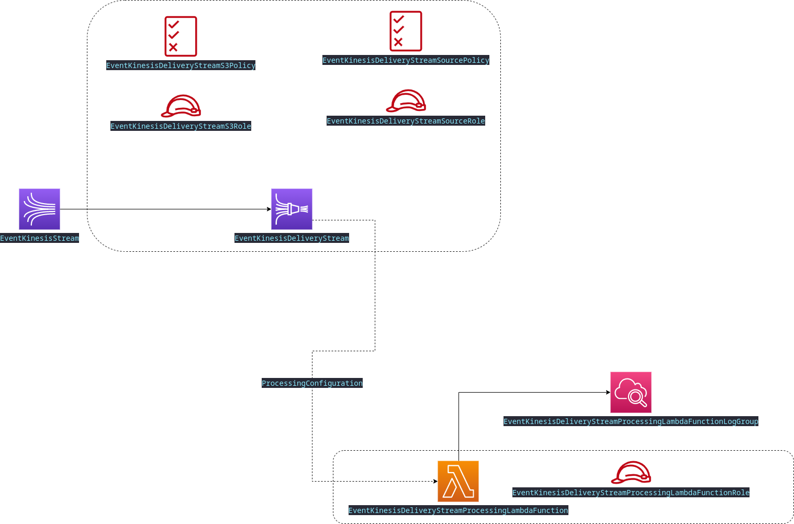

# CloudFormation Template Example for API Gateway to Lambda to Kinesis to S3 to SNS Event to Lambda

The resources are all defined in the [template file](template.yaml).

The following environment variables is assumed in the command examples:

| Environment Variable Example      | Description                                      |
|-----------------------------------|--------------------------------------------------|
| `export AWS_PROFILE="..."`        | The AWS Credentials Profile to use               |
| `export AWS_REGION="..."`         | The AWS Region to deploy resources to            |
| `export STACK_NAME="..."`         | The name of the CloudFormation stack             |
| `export PARAMETERS_FILE="..."`    | The file containing the stack parameters         |

The parameters to pass into the CloudFOrmation template during deployment must be defined using the following template:

```json
{
    "Parameters": {
      "S3EventBucketParam": "..."
    }
}
```

Assuming you are in the root of this repository, the command to deploy the cloudformation template is as follow:

```shell
aws cloudformation deploy \
    --stack-name $STACK_NAME \
    --template-file labs/lab2-construct-cloudformation-template-from-lab1-findings/template.yaml \
    --parameter-overrides file://$PARAMETERS_FILE \
    --capabilities CAPABILITY_NAMED_IAM
```

> Progress on 2022-08-24: I tried using KMS, but I seem to miss some kind of permission or policy as I could not get SNS to send messages to SQS, even when both services referenced the same KMS key. See commit 62ce58db5db99e6db91d2b92b4767438d1f258d6 (2022-08-24 05:38) for the config used. I will figure this out at a later stage. I may need to look [at this blog post](https://sbstjn.com/blog/aws-secured-sqs-sns-subscription-with-kms/) for some inspiration to get this to work.

## S3 Events to Lambda (Testing S3 events by just uploading a normal TXT file from the AWS Console)

Looking just at the S3 events and how that is handled downstream, the following CloudFormation resources are relevant:



When the final Lambda function (right at the tail end of this whole series of events) receives the S3 event, the `event` has the following structure:

```json
{
    "Records": [
        {
            "messageId": "aaaaaaaa-aaaa-aaaa-aaaa-aaaaaaaaaaaa",
            "receiptHandle": "aaaaaaaaaaaaaaaaaaaa",
            "body": "--BODY--",
            "attributes": {
                "ApproximateReceiveCount": "1",
                "SentTimestamp": "1661316591605",
                "SenderId": "AAAAAAAAAAAAAAAAAAAAA",
                "ApproximateFirstReceiveTimestamp": "1661316591611"
            },
            "messageAttributes": {},
            "md5OfBody": "aaaaaaaaaaaaaaaaaaaaaaaaaaaaaaaa",
            "eventSource": "aws:sqs",
            "eventSourceARN": "arn:aws:sqs:eu-central-1:000000000000:S3EventStoreNotificationQueue",
            "awsRegion": "eu-central-1"
        }
    ]
}
```

> _**Note**_: The CloudFormation template configured the Lambda function to receive up to 10 records at a time.

The `--BODY--` portion of the message was JSON text with the following content:

```json
{
    "Type": "Notification",
    "MessageId": "aaaaaaaa-aaaa-aaaa-aaaa-aaaaaaaaaaaa",
    "TopicArn": "arn:aws:sns:eu-central-1:000000000000:S3EventStoreNotification",
    "Subject": "Amazon S3 Notification",
    "Message": "--MESSAGE--",
    "Timestamp": "2022-08-24T04:49:51.569Z",
    "SignatureVersion": "1",
    "Signature": "aaaaaaaaaaaaaaaaaaaaaaaaaaaaaaaa",
    "SigningCertURL": "aaaaaaaaaaaaaaaaaaaaaaaaaaaaaaaa",
    "UnsubscribeURL": "aaaaaaaaaaaaaaaaaaaaaaaaaaaaaaaa"
}
```

So, we can see this is specifically an S3 notification. This is handy for ensuring we process only the appropriate messages in the Lambda function

The `--MESSAGE--` is another JSON message with the following structure:

```json
{
    "Records": [
        {
            "eventVersion": "2.1",
            "eventSource": "aws:s3",
            "awsRegion": "eu-central-1",
            "eventTime": "2022-08-24T04: 49: 50.944Z",
            "eventName": "ObjectCreated:Put",
            "userIdentity": {
                "principalId": "AWS:AAAAAAAAAAAAAAAAAAAA"
            },
            "requestParameters": {
                "sourceIPAddress": "nnn.nnn.nnn.nnn"
            },
            "responseElements": {
                "x-amz-request-id": "aaaaaaaaaaaaaaaa",
                "x-amz-id-2": "aaaaaaaaaaaaaaaaaaaaaaaaaaaaaaaa"
            },
            "s3": {
                "s3SchemaVersion": "1.0",
                "configurationId": "aaaaaaaa-aaaa-aaaa-aaaa-aaaaaaaaaaaa",
                "bucket": {
                    "name": "--BUCKET-NAME--",
                    "ownerIdentity": {
                        "principalId": "aaaaaaaaaaaaaa"
                    },
                    "arn": "arn:aws:s3:::--BUCKET-NAME--"
                },
                "object": {
                    "key": "test_file.txt",
                    "size": 80,
                    "eTag": "0565a595fc3db300b1a0a3f392496e9d",
                    "sequencer": "006305ADEEE5B6E47A"
                }
            }
        }
    ]
}
```

Here are some Python code to manage the event:

```python
# Assuming the original event is in the variable `event`
record_nr = 0
for record in event['Records']:
    record_nr += 1
    event_body = json.loads(record['body']) 
    s3_message = json.loads(event_body['Message'])
    print('Record nr {}'.format(record_nr))
    print('\tType       : {}'.format(event_body['Type']))
    print('\tSubject    : {}'.format(event_body['Subject']))
    for s3_record in s3_message['Records']:
        print('\t\tS3 Bucket Name : {}'.format(s3_record['s3']['bucket']['name']))
        print('\t\tEvent Key      : {}'.format(s3_record['s3']['object']['key']))
```

The output from the above looks something like:

```text
Record nr 1
        Type       : Notification
        Subject    : Amazon S3 Notification
                S3 Bucket Name : --BUCKET-NAME--
                Event Key      : test_file.txt

```

## Internet Facing API Gateway to Lambda API Gateway Integration Handler

The following stack portion was added that would add resources to get traffic from the Internet into the environment.



The configuration allows for both HTTP Access Logs as well as Lambda logging.

A typical `curl` test is demonstrated below:

```shell
# Get the API ID...
export API_URL=`aws cloudformation --region "$AWS_REGION" describe-stacks --stack-name $STACK_NAME --output json | jq ".Stacks[0].Outputs[].OutputValue" | egrep "^\"https" | awk -F\" '{print $2}'`

curl -vvv -d '{"Message": "Test123"}' -H "Content-Type: application/json" -X POST $API_URL/sandbox/test01
```

## Integrating the Kinesis Components

The final part of the CloudFormation template is to add the AWS Kinesis components, as depicted in the following diagram:



The Lambda function from the API Gateway will be the producer of events and the events will be processed in the Kinesis stream by a Lambda function before being persisted in S3.

## Final Testing and Verification

Once the entire stack is deployed, the results can be verified with the `curl` command from the previous section, and then use the following commands to validate the test.

The final result (after some minutes - due to Kinesis buffering), can be observed by the event object being present in S3:

```shell
# first, get our bucket. - s3.amazonaws.com
export S3_BUCKET_DOMAIN=`aws cloudformation --region "$AWS_REGION" describe-stacks --stack-name $STACK_NAME --output json | jq ".Stacks[0].Outputs[].OutputValue" | grep "s3.amazonaws.com" | awk -F\" '{print $2}'`
export S3_BUCKET_NAME=`echo $S3_BUCKET_DOMAIN | awk -F\. '{print $1}'`

# Get the object listing from our bucket
aws s3 ls --recursive s3://$S3_BUCKET_NAME/
export FILE_1_PATH=`aws s3 ls --recursive s3://$S3_BUCKET_NAME/ | head -1 | awk '{print $4}'`

# Get the object:
aws s3 cp s3://$S3_BUCKET_NAME/$FILE_1_PATH /tmp/event_1 

file /tmp/event_1 
# You want to see the following output: /tmp/event_1: gzip compressed data, from FAT filesystem (MS-DOS, OS/2, NT), original size....

zcat /tmp/event_1
# You want to see the following output: {"numberOfFields": 1, "fieldNames": "Message"}
```

Finally, we want to check that the lambda function reacting to events in S3 was also triggered. You can do this with the AWS console to search for the events in `CloudWatch >> Log groups >>/aws/lambda/EventMockProcessingLambdaFunction`. You can run the same Python script as in the section `S3 Events to Lambda (Testing S3 events by just uploading a normal TXT file from the AWS Console)` , and you should get output looking similar to the following:

```python
>>> import json
>>> event={'Records': [......]}
>>> record_nr = 0
>>> for record in event['Records']:
...     record_nr += 1
...     event_body = json.loads(record['body']) 
...     s3_message = json.loads(event_body['Message'])
...     print('Record nr {}'.format(record_nr))
...     print('\tType       : {}'.format(event_body['Type']))
...     print('\tSubject    : {}'.format(event_body['Subject']))
...     for s3_record in s3_message['Records']:
...         print('\t\tS3 Bucket Name : {}'.format(s3_record['s3']['bucket']['name']))
...         print('\t\tEvent Key      : {}'.format(s3_record['s3']['object']['key']))
... 
Record nr 1
        Type       : Notification
        Subject    : Amazon S3 Notification
                S3 Bucket Name : oculusd-lab2-events
                Event Key      : 2022/08/28/07/EventKinesisDeliveryStream-1-2022-08-28-07-27-46-6434e064-ef19-42d0-a232-25ba89cf375e.gz
>>> 
```

If all of the above steps work, the experiment was successful. 

## Lab Cleanup

Run the following commands to cleanup all resources:

```shell
# Delete the stack
aws cloudformation delete-stack --stack-name "$STACK_NAME"

# Delete the S3 bucket
aws s3 rm s3://$S3_BUCKET_NAME/ --recursive
aws s3api delete-bucket --bucket $S3_BUCKET_NAME
```

The CloudFormation template should be completely deleted in 5 to 10 minutes.

