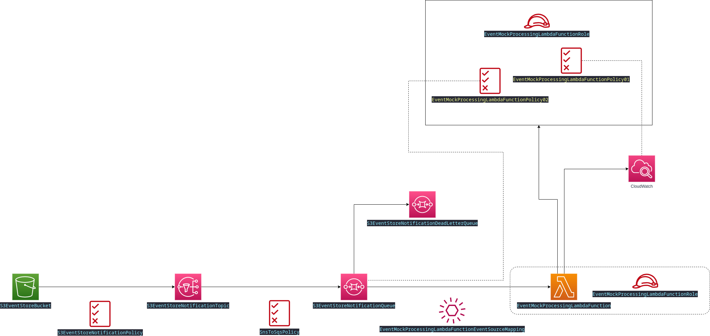

# Lab 3 Goals

The main goal of this lab is to adapt lab 2 to create a hybrid Kinesis and direct S3 put solution (splitting high volume and low volume data ingestion processes).

I also want to start to introduce the example scenario in this lab, just to make it a little more practical. Therefore, a number of resources will be created and as such I need to start to think also about how the business logic is split from the Infrastructure.

I am going to attempt to implement a private API as well in order to cater for scenario 1 where a new access card is issued to a employee.

For this exercise to be practical, I would require a privately hosted web front-end which will be a very basic Docker based we application (written in Python). The web application will be running in a Docker container on an EC2 instance running in a Private VPC. There will be a Elastic Load Balancer on the Public VPC to access the private EC2 instance web service and in turn I will bind the ELB domain to a custom domain name which I have purchased manually through the AWS Route 53 service. No authentication will be done at this point.

The web application is very straight forward. A form will be presented where a building ID, an employee ID and a Access Card ID is entered. When the form is submitted, an event to link the two entities is created and when processed, the linked card will be stored in DynamoDB with an initial state of `INSIDE` and the initial building ID set to the building ID from the form. In other words, we assume the employee to be present when handed the card in the building with the relevant building ID. He is therefore inside the building.

The event will be created by the containerized application by publishing to an SNS topic. The SNS topic will forward the message to an SQS queue from where a Lambda function will generate the final event and persist it to S3. The API gateway will require at least the following API end-points:

| API Endpoint                                                   | Method | Expected Input Data                                                                                                                          | Processing                                                                                            | Result                                    |
|----------------------------------------------------------------|:------:|----------------------------------------------------------------------------------------------------------------------------------------------|-------------------------------------------------------------------------------------------------------|-------------------------------------------|
| `/building-access/link-employee-and-card`                      | POST   | JSON Post with the following data:  <ul><li>HR Employee ID</li><li>Building ID</li><li>New Employee ID</li><li>Access Card ID</li></ul> | Basic input validation. Construct SNS message and publish to SNS topic.                               | Return `OK` when SNS Accepted the message |
| `/building-access/employee-access-card-status/<<employee-id>>` | GET    | Path variable `employee-id` with the employee ID for which the card must be retrieved.                                                       | Directly query the DynamoDB to search for the employee ID and retrieve the linking fields and status. | Return JSON object with data              |
| `/hr/employee-ids`                                             | GET    | Query string: `max-items` (max. 100, default=100) and then the `start` index position (optional, default=0)                                  | Retrieve employee ID's, limit by `max-items` staring at position `start`                              | Return JSON object employee ID's          |

Each of the API endpoints is services by a Lambda function.

# Application Components

What is of particular interest for me here is how I can split the business logic (Docker image, Lambda functions etc.) from Infrastructure (the rest).

From a high level process perspective refer to the following diagram:

Physical world scenario walk through:

* A new employee does not have an access card. They are physically present in a building where the card will be issued.
* The new employee meets up with an authorized representative that will issue an access card to the employee
* The authorized representative captures the data in the system before handing over the access card to the new employee
* When the authorized representative can confirm that the card has been issued, the physical card is now actually issued to the employee

From an infrastructure and application perspective, we have the following context diagram:

From the design exercise, I now start to understand what Infrastructure is really core to the event store, which is basically the following components from the original template in Lab 2:

I will therefore now see how I split up my infrastructure into more logic parts. For now, I have identified the following:

* Events base Infrastructure (as per the image above)
* The EC2 Internal Web Hosting Infrastructure
* Access card linking Infrastructure - basically just an SNS topic and SQS queue that binds the event in S3 to the final Lambda function that updates the state in DynamoDB.

> _**Observation**_: What I still need to see is how I develop these independently and then link then up somehow... Imaging there was different teams developing the various stacks and pipelines - how do they need to coordinate?

## DynamoDB Design

TODO

## Lambda Function for Listing Employee ID's

TODO

## Lambda Function For getting the status of a specific employee and their access card

TODO

## Lambda Function for Linking an employee ID, Access Card and Building ID with an initial default building status of `INSIDE`

TODO

# Infrastructure Components 

## Serving of a Docker based web site from EC2 (private only), accessed via a proxy server in a Public VPC

TODO

## Event Infrastructure

TODO

## Private API Gateway to access the Lambda API's.

TODO

# Random Thoughts

Something that occurred to me while I was designing this solution was to think about why I would still expose certain applications via EC2 - why not have everything as serverless?

The fact is that sometime we still have to deal with off-the-shelve products, and I am treating this web app as a typical example. In theory I could also just host it directly from S3, but I would like to use this opportunity to exercise some other concepts as well, even though they may not be too high on the cool-scale.
