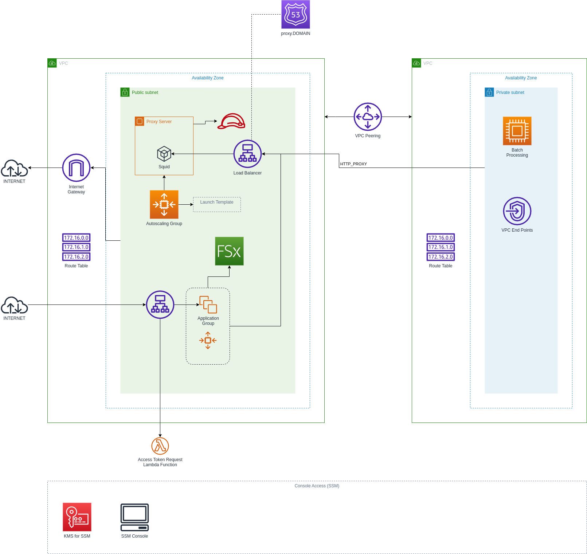

- [Lab 3 Goals](#lab-3-goals)
- [CLI Environment](#cli-environment)
- [Application Components](#application-components)
  - [DynamoDB Design](#dynamodb-design)
    - [Partition Key](#partition-key)
    - [Sort Key](#sort-key)
    - [NoSQL Workbench Model](#nosql-workbench-model)
  - [Pre-populating Data](#pre-populating-data)
  - [Lambda Function for Listing Employee ID's](#lambda-function-for-listing-employee-ids)
  - [Lambda Function For getting the status of a specific employee and their access card](#lambda-function-for-getting-the-status-of-a-specific-employee-and-their-access-card)
  - [Lambda Function(s) for Linking an employee ID, Access Card and Building ID with an initial default building status of `INSIDE`](#lambda-functions-for-linking-an-employee-id-access-card-and-building-id-with-an-initial-default-building-status-of-inside)
  - [Lambda Function Deployment](#lambda-function-deployment)
- [Infrastructure Components](#infrastructure-components)
  - [VPC and Proxy Server](#vpc-and-proxy-server)
  - [Serving of a web site from EC2 (private only), accessed via a proxy server in a Public VPC](#serving-of-a-web-site-from-ec2-private-only-accessed-via-a-proxy-server-in-a-public-vpc)
  - [Handling Updates to Static Web Pages](#handling-updates-to-static-web-pages)
  - [Event Infrastructure](#event-infrastructure)
  - [Private API Gateway to access the Lambda API's.](#private-api-gateway-to-access-the-lambda-apis)
- [Random Thoughts](#random-thoughts)

# Lab 3 Goals

The main goal of this lab is to adapt lab 2 to create a hybrid Kinesis and direct S3 put solution (splitting high volume and low volume data ingestion processes).

I also want to start to introduce the example scenario in this lab, just to make it a little more practical. Therefore, a number of resources will be created and as such I need to start to think also about how the business logic is split from the Infrastructure.

I am going to attempt to implement a private API as well in order to cater for scenario 1 where a new access card is issued to a employee.

For this exercise to be practical, I would require a privately hosted web front-end which will be a very basic Docker based we application (written in Python). The web application will be running in a Docker container on an EC2 instance running in a Private VPC. There will be a Elastic Load Balancer on the Public VPC to access the private EC2 instance web service and in turn I will bind the ELB domain to a custom domain name which I have purchased manually through the AWS Route 53 service. No authentication will be done at this point.

The web application is very straight forward. A form will be presented where a building ID, an employee ID and a Access Card ID is entered. When the form is submitted, an event to link the two entities is created and when processed, the linked card will be stored in DynamoDB with an initial state of `INSIDE` and the initial building ID set to the building ID from the form. In other words, we assume the employee to be present when handed the card in the building with the relevant building ID. He is therefore inside the building.

The event will be created by the containerized application by publishing to an SNS topic. The SNS topic will forward the message to an SQS queue from where a Lambda function will generate the final event and persist it to S3. The API gateway will require at least the following API end-points:

| API Endpoint                                                   | Method | Expected Input Data                                                                                                                          | Processing                                                                                            | Result                                    |
|----------------------------------------------------------------|:------:|----------------------------------------------------------------------------------------------------------------------------------------------|-------------------------------------------------------------------------------------------------------|-------------------------------------------|
| `/building-access/link-employee-and-card`                      | POST   | JSON Post with the following data: <br /><ul><li>HR Employee ID</li><li>Building ID</li><li>New Employee ID</li><li>Access Card ID</li></ul> | Basic input validation. Construct SNS message and publish to SNS topic.                               | Return `OK` when SNS Accepted the message |
| `/building-access/employee-access-card-status/<<employee-id>>` | GET    | Path variable `employee-id` with the employee ID for which the card must be retrieved.                                                       | Directly query the DynamoDB to search for the employee ID and retrieve the linking fields and status. | Return JSON object with data              |
| `/hr/employee-ids`                                             | GET    | Query string: `max-items` (max. 100, default=100) and then the `start` index position (optional, default=NULL)                                  | Retrieve employee ID's, limit by `max-items` staring at position `start`                           | Return JSON object employee ID's          |

Each of the API endpoints is services by a Lambda function.

# CLI Environment

When running commands, the following environment variables are assumed to be set:

| Environment Variable Example             | Description                                                                         |
|------------------------------------------|-------------------------------------------------------------------------------------|
| `export AWS_PROFILE="..."`               | The AWS Credentials Profile to use                                                  |
| `export AWS_REGION="..."`                | The AWS Region to deploy resources to                                               |
| `export PARAMETERS_FILE="..."`           | The file containing the stack parameters                                            |
| `export DYNAMODB_STACK_NAME="..."`       | The CloudFormation stack name for deploying the DynamoDB Table                      |
| `export LAMBDA_STACK_NAME="..."`         | The CloudFormation stack name for deploying Lambda Functions                        |
| `export VPC_STACK_NAME="..."`            | The CloudFormation stack name for deploying the VPC resources                       |
| `export NFS_STACK_NAME="..."`            | The CloudFormation stack name for deploying a FSX Filesystem                        |
| `export DNS_STACK_NAME="..."`            | The CloudFormation stack name for deploying DNS and ACM                             |
| `export PROXY_STACK_NAME="..."`          | The CloudFormation stack name for deploying the Proxy server                        |
| `export GITHUB_SECRET_STACK_NAME="..."`  | The CloudFormation stack name for deploying the GitHub SSH Key in Secrets Manager   |
| `export GITHUB_SYNC_STACK_NAME="..."`    | The CloudFormation stack name for deploying the GitHub Sync Resources               |
| `export ARTIFACT_S3_BUCKET_NAME="..."`   | The S3 Bucket name containing any additional artifacts                              |
| `export EC2_KEYPAIR_KEY_NAME="..."`      | A pre-existing EC2 Key Pair Key Name                                                |

Some of these variables, like 

# Application Components

What is of particular interest for me here is how I can split the business logic (Docker image, Lambda functions etc.) from Infrastructure (the rest).

From a high level process perspective refer to the following diagram:


Physical world scenario walk through:

* A new employee does not have an access card. They are physically present in a building where the card will be issued.
* The new employee meets up with an authorized representative that will issue an access card to the employee
* The authorized representative captures the data in the system before handing over the access card to the new employee
* When the authorized representative can confirm that the card has been issued, the physical card is now actually issued to the employee

From an infrastructure and application perspective, we have the following context diagram:


From the design exercise, I now start to understand what Infrastructure is really core to the event store, which is basically the following components from the original template in Lab 2:


I will therefore now see how I split up my infrastructure into more logic parts. For now, I have identified the following:

* Events base Infrastructure (as per the image above)
* The EC2 Internal Web Hosting Infrastructure
* Access card linking Infrastructure - basically just an SNS topic and SQS queue that binds the event in S3 to the final Lambda function that updates the state in DynamoDB.

> _**Observation**_: What I still need to see is how I develop these independently and then link then up somehow... Imaging there was different teams developing the various stacks and pipelines - how do they need to coordinate?

## DynamoDB Design

For this exercise, all data will be gathered in 1x DynamoDB table. Even though the HR system may have their own application sets and table(s), this particular table is for associating employees with access cards as well as tracking which the access card usage status, relative to a building (when applicable).

As such, I started with a composite key design with the following structure:

### Partition Key

Key name: `subject-id`

Made up of a subject ID, in two parts: `subject-type` and `subject-id-hash`

Subject types can be:

* `Employee` and the ID is a SHA256 hash of the employee number
* `Access Card` and the ID is a SHA256 hash of the access card number
* `Building` and the ID is a SHA256 hash of the building identifier
* `Employee Access Card Link` and the ID is the SHA256 hash of a concatenated string of the employee ID and the access card id

Employee ID's end with the letter `-E` while access card ID's start with the letters `AC`. Before these letter, and only for the purpose of this exercise, we will use sequential numbers for each new employee number or access card, and in both cases we will start at the number `100000000000` which will more-or-less guarantee a 12 digit number for each employee or access card.

Building identifiers end with the letter `-B` and before this sequence a ID which will also be a sequential number similar to the employee and access cards.

the employee access card links is just a combination (concatenation) of the Employee partition key and the access card partition key.

Examples:

| Subject Type | ID Number    | Partition Key Value                                                  |
|--------------|--------------|----------------------------------------------------------------------|
| Employee     | 100000000000 | `7105a7c94731c3b17021741601573512622e20d6eb5ef8d90bd703d09ea5263f-E` |
| Employee     | 100000000001 | `48af5465f4e26fcd41c9021ea531ba3f62b7e1bb2aca74bbb20aca7cdb0eb6d2-E` |
| Employee     | 100000000002 | `f72b23f5379310fb749a3971af2f7523139108e24a5ccda07bff4d4bff9a2c78-E` |
| Employee     | 100000001998 | `59d05236b40f6db1e6e7e95b2e5729241c442fc4d007cf73bf0ff816a1ecd4fd-E` |
| Employee     | 100000001999 | `3d1d121a7f823e4600dff2b291b476b02fb8f1ea399e48b811709240f8bc2591-E` |
| Employee     | 100000002000 | `807ced1921f9bae1401b80e21fec0cd679ef489a625cfd2e33e61132db2a8296-E` |
| Access Card  | 100000000000 | `cf3121e8d17be03ffcbc620a4e9c80c4b5c46966885357df7baa27bb2655ef4cAC` |
| Access Card  | 100000000001 | `fca8c49d4501aa9fdd5fa1ea8e3e56172ee1e65b2ebfb8a2bca8ce48c3386edbAC` |
| Access Card  | 100000000002 | `0654b48384296e5fdd830847cf4912c821189801667c5a50656185f7759fe087AC` |
| Access Card  | 100000001998 | `f208e56b37248f5c441d996065dbb5de4c8eb64dfaffe617dbd71b0314ef502fAC` |
| Access Card  | 100000001999 | `7bc00ee3e73679a2f73ee654a2e2c3a2537df8ea52578c4cefcb01e2856d1d66AC` |
| Access Card  | 100000002000 | `5fa8c78d95177dca11e68b6001a0d1db5bd0711df2aca6dc0aa39b8c2f9bab71AC` |
| Building     | 100000000000 | `ec7f1f0113ff321c8fa7374c6b1cb55a216ee45ad1a1763bb6ef6b9db1c8d20f-B` |
| Building     | 100000000001 | `7c4b67e9caad0fee493793b9b62474e4854dc2b254b12ee18d483630071939d2-B` |
| Building     | 100000000098 | `0e3b534f6483c9ab9223ea668363834a1b2402fc356a470888dcd1792ca24a9d-B` |
| Building     | 100000000099 | `a2f064a59b5bd27804cab668cb1629b5eb53f3d74f1f0d56cae4a6e6a6c8c450-B` |

Example of Linked Employee and Access Cards:

| Employee ID  | Access Card ID | Linked Partition Key Value                                           |
| -------------|----------------|----------------------------------------------------------------------|
| 100000001998 | 100000002000   | `8e959c586a66cde558dbd72c4c98e2b2e57d4a29f323b1dc5497a4029235cd6cLS` |
| 100000001999 | 100000000002   | `63d8d9f21e6533b3796405ccefab997c18e4bbbbafd9aa68dc4283837bff34beLS` |
| 100000000001 | 100000000000   | `b24bc4861d51dfcb7379340626fcd24544992ce91eea46b92ee5d5a7a4b97ed2LS` |
| 100000000002 | 100000001999   | `5ae87607e7b003e321202f9811109c4a11a57b725906929ec8c2b343a920b229LS` |
| 100000002000 | 100000001998   | `c118124c8e66e34ca9bb9e55c4191a0b4973c9737ca5d0668b8f6fcb35eb4556LS` |
| 100000000000 | 100000000001   | `f52b036dfdc8ed952029d697a8114785dc780d8eaefed8ba928d6f2ecfdcb2bbLS` |

The partition keys are random enough to guarantee a good spread through the various DynamoDB partitions.

Python functions to calculate the various partition key values are demonstrated in the file [`poc_calc_key_values.py`](poc_calc_key_values.py) and this script was used to create the table data for the tables above.

### Sort Key

Key name: `subject-topic`

The sort key will be used in our table to describe the type of record that we store as well as serving as a convenient way to search for related data items.

The general structure of the sort key will be `subject-type#record-type`

The subject types is already known and the subject ID will be either an Employee ID or Building ID, but in terms of the `record-type` the following is note worthy:

| Subject Type       | Record Type   | Example Sort Key                 | Example Record Data Fields                                                                                                                                                                                                                                                                                                                                             |
|--------------------|---------------|----------------------------------|------------------------------------------------------------------------------------------------------------------------------------------------------------------------------------------------------------------------------------------------------------------------------------------------------------------------------------------------------------------------|
| Employee           | `profile`     | `employee#profile`               | <ul><li>Employee ID</li><li>First Name</li><li>Last Name</li><li>Department</li><li>Status (onboarding or active or disabled)</li></ul>                                                                                                                                                                                                                                |
| Access Card        | `profile`     | `access-card#profile`            | <ul><li>Access Card ID</li><li>Status (unissued or issued or defunct)</li><li>Issued To (Partition Key Value of Employee)</li></ul>                                                                                                                                                                                                                                    |
| Building           | `profile`     | `building#profile`               | <ul><li>Building ID</li><li>Status (active or not-in-use)</li><li>Country ISO Code (3 letter)</li><li>Location Postal or Zip Code</li><li>Building Name</li></ul>                                                                                                                                                                                                      |
| Linked Access Card | `association` | `linked-access-card#association` | <ul><li>Timestamp linked</li><li>Employee ID of Linker (partition key of who linked the employee with this access card</li><li>Status (active or card-defunct)</li><li>Building State (either `INSIDE` or `NULL`)</li><li>Current Building ID (set if state is `INSIDE` to the building ID)</li><li>Employee Partition Key</li><li>Access Card Partition Key</li></ul> |
| Building Occupiers | `employees`   | `building-occupiers#employees`   | <ul><li>Access Card Scanned Timestamp</li><li>Linked Access Card Partition Key</li><li>Building Partition Key</li></ul>                                                                                                                                                                                                                                                |

> _**Note**_: While an employee is new and without an access card, the status is `onboarding`. As soon as the access card is issued, the status must be updated to `active`

Access cards scanned will only be allowed in the building when the following conditions are met:

* Access card ID must exist with status `issued`
* Employee must exist with status `active`
* The Linked Access Card status must be `active`
* The current building state value for the linked access card must be `NULL`

Access card can only be issued to employees when the following conditions are met:

* Access card ID must exist with status `unissued`
* Employee must exist with status `onboarding`
* For the purpose of this test, the employee linking the two must be in status `active` with an employee id less than 100 (any of the first 100 employees can issue cards to other employees - this will be our starting state and we assume that these first 100 employees are authorized to issue these cards)

### NoSQL Workbench Model

The following files are included:

* [AccessCardDemo.json](AccessCardDemo.json) - The AWS DynamoDB NoSQL Workbench Export file (You can download the Workbench [from here](https://docs.aws.amazon.com/amazondynamodb/latest/developerguide/workbench.settingup.html))
* [AccessCardDemo_cf_template.json](AccessCardDemo_cf_template.json) - Original exported CloudFormation file
* [AccessCardDemo_cf_template.yaml](AccessCardDemo_cf_template.yaml) - Reworked and well formatted CloudFormation file in YAML

Included in the model is the proposed field names as well as the facet views from the tables above

Deploying the table can be done with the following command:

```shell
aws cloudformation deploy \
    --stack-name $DYNAMODB_STACK_NAME \
    --template-file labs/lab3-non-kinesis-example/cloudformation/1000_dynamodb.yaml
```

## Pre-populating Data

A python script is provided to pre-populate the table with some initial data. The script can be located in the file [`prepopulate_data.py`](prepopulate_data.py)

Assuming the environment variables are set (as per the exports table), the supplied credentials must be sufficient to write to DynamoDB.

Each time the script run, it will assume it starts with an empty table.

> _**IMPORTANT**_: Delete the stack, recreate the stack and then run the script

> _**WARNING**: This may take a while and is an expensive operation!

Typical run:

```shell
aws cloudformation delete-stack --stack-name $DYNAMODB_STACK_NAME

# WAIT UNTIL STACK IS DELETED ....

aws cloudformation deploy \
    --stack-name $DYNAMODB_STACK_NAME \
    --template-file labs/lab3-non-kinesis-example/cloudformation/1000_dynamodb.yaml

# WAIT UNTIL STACK IS DONE

python3 labs/lab3-non-kinesis-example/prepopulate_data.py
```

Below are some example records:

> Example of an Employee Record:


> Example of an available for issue Access Card Record:


> Example of an Access Card Record, issued to an Employee:


> Example of an Linked Access Card Record:


## Lambda Function for Listing Employee ID's

The Lambda function will have the following characteristics:

* Supports only the GET method
* Query string variables: 
    * `max-items` - INTEGER - min. 10 and max. 100, default=100
    * `start` STRING - index key to start again (as returned by a previous query)

The Lambda function is located in the file [`list_employee_ids.py`](lambda_functions/list_employee_ids/list_employee_ids.py)

## Lambda Function For getting the status of a specific employee and their access card

TODO

## Lambda Function(s) for Linking an employee ID, Access Card and Building ID with an initial default building status of `INSIDE`

TODO

## Lambda Function Deployment

Each Lambda function must be zipped and uploaded to S3:

```shell
rm -vf labs/lab3-non-kinesis-example/lambda_functions/list_employee_ids/list_employee_ids_lambda_function.zip

cd labs/lab3-non-kinesis-example/lambda_functions/list_employee_ids/ && zip list_employee_ids_lambda_function.zip list_employee_ids.py && cd $OLDPWD 

aws s3 cp labs/lab3-non-kinesis-example/lambda_functions/list_employee_ids/list_employee_ids_lambda_function.zip s3://$ARTIFACT_S3_BUCKET_NAME/list_employee_ids_lambda_function.zip
```

All Lambda functions are defined in a single CloudFormation template that can be deployed with:

Deploying the table can be done with the following command:

```shell
aws cloudformation deploy \
    --stack-name $LAMBDA_STACK_NAME \
    --template-file labs/lab3-non-kinesis-example/cloudformation/2000_lambda_functions.yaml \
    --parameter-overrides S3SourceBucketParam="$ARTIFACT_S3_BUCKET_NAME" \
    --capabilities CAPABILITY_NAMED_IAM
```

# Infrastructure Components 

## VPC and Proxy Server

The lab relies on a private and public VPC and use a Proxy Server for Internet access from the Private VPC. Run the following command to provision the resources:

```shell
aws cloudformation deploy \
    --stack-name $VPC_STACK_NAME \
    --template-file labs/lab3-non-kinesis-example/cloudformation/3000_vpc_setup.yaml

aws cloudformation deploy \
    --stack-name $DNS_STACK_NAME \
    --template-file labs/lab3-non-kinesis-example/cloudformation/3100_dns.yaml \
    --parameter-overrides VpcStackNameParam="$VPC_STACK_NAME"

aws cloudformation deploy \
    --stack-name $PROXY_STACK_NAME \
    --template-file labs/lab3-non-kinesis-example/cloudformation/3200_proxy_server.yaml \
    --parameter-overrides VpcStackNameParam="$VPC_STACK_NAME" DnsStackNameParam="$DNS_STACK_NAME" Ec2KeyPairKeyNameParam="$EC2_KEYPAIR_KEY_NAME" \
    --capabilities CAPABILITY_NAMED_IAM
```

Basic VPC design:



> _**Interesting Observation**_: The proxy server responds with a HTTP code 400 during health checks. This is actually OK, and therefore the 400 code is used in the Target Group health checks to assume a healthy state.

## Serving of a web site from EC2 (private only), accessed via a proxy server in a Public VPC

TODO

* ~~Create OpenZFS NFS Share for hosting web source files~~
* ~~Synchronize a SSH key (for GitHub) with Secrets Manager~~
* Create EC2 instance that the Lambda function can start in order to sync static web site artifacts to FSX. The EC2 instance will self-terminate once done
    * Fix Proxy COnfig to include CIDR's
* Create a Lambda function, exposed with a URL, that GitHub can call (webhook integration)
* Create application launch template to server these files using nginx (mount NFS read only)
* Create autoscaling group for application cluster and host in private VPC
* Create inbound load balancer in public VPC to connect to application cluster in private VPC
* Add Route 53 entries for application (CNAME to Load Balancer) (intranet.DOMAIN) - NOTE: Even though this is an "internal" application, I don't have a VPN peering connection so I will come in via the Internet to test the application. Another option to consider is to use SSH tunneling through a jump host....

As a demonstration, I wanted to synchronize the web site static files from GitHub to the FSX file system. The static web site artifacts is kept in a separate [GitHub repository](https://github.com/nicc777/exploring-aws-kinesis-static-website) as I needed to create a webhook in that repository that will call a URL from a Lambda Function that will trigger the internal processes to synchronize the static content with the FSX volume. Any commit in that repository should therefore trigger the web hook.

> _**Important Pre-Requisite**_: A SSH key must be available in order to create a copy of that key in Secrets Manager, that can later be accessed to connect to GitHub and synchronize the web site.

To create the OpenZFS NFS Filesystem that will host the website static content, run the following command:

```shell
aws cloudformation deploy \
    --stack-name $NFS_STACK_NAME \
    --template-file labs/lab3-non-kinesis-example/cloudformation/4000_fsx_filesystem.yaml \
    --parameter-overrides VpcStackName="$VPC_STACK_NAME"

aws cloudformation deploy \
    --stack-name $GITHUB_SECRET_STACK_NAME \
    --template-file labs/lab3-non-kinesis-example/cloudformation/4100_github_secret.yaml

# Assuming your GitHub SSH key is in the file ~/.ssh.github_key.pem, run the following command:
export GITHUB_KEY=`cat ~/.ssh/github_key.pem`

# Get the newly created secret ARN
export GITHUB_SECRET_ID=`aws cloudformation describe-stacks --stack-name $GITHUB_SECRET_STACK_NAME | jq ".Stacks[0].Outputs[0].OutputValue" | awk -F\" '{print $2}'`

# Load the SSH key data into the secret
aws secretsmanager put-secret-value --secret-id $GITHUB_SECRET_ID --secret-string "$GITHUB_KEY"

# SSH key data no longer required - ensure it is removed from our environment data
unset GITHUB_KEY

aws cloudformation deploy \
    --stack-name $GITHUB_SYNC_STACK_NAME \
    --template-file labs/lab3-non-kinesis-example/cloudformation/4200_github_deployment_resources.yaml \
    --parameter-overrides VpcStackNameParam="$VPC_STACK_NAME" \
        GitHubSecretStackNameParam="$GITHUB_SECRET_STACK_NAME" \
        DnsStackNameParam="$DNS_STACK_NAME" \
        ProxyServerStackNameParam="$PROXY_STACK_NAME" \
    --capabilities CAPABILITY_NAMED_IAM
```

## Handling Updates to Static Web Pages

I want to try the following design:


The basic idea is that any commits to a certain repository will then call the Lambda function (Exposed by a URL). The information from the call will be parsed (details still unknown) and from that information a message will be placed on SQS.

A second Lambda function will retrieve that message

## Event Infrastructure

TODO

## Private API Gateway to access the Lambda API's.

TODO

# Random Thoughts

Something that occurred to me while I was designing this solution was to think about why I would still expose certain applications via EC2 - why not have everything as serverless?

The fact is that sometimes we still have to deal with off-the-shelve products, and I am treating this web app as a typical example. In theory I could also just host it directly from S3, but I would like to use this opportunity to exercise some other concepts as well, even though they may not be too high on the cool-scale.
